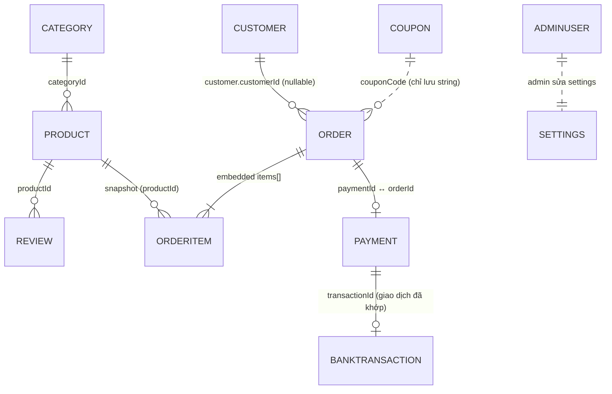
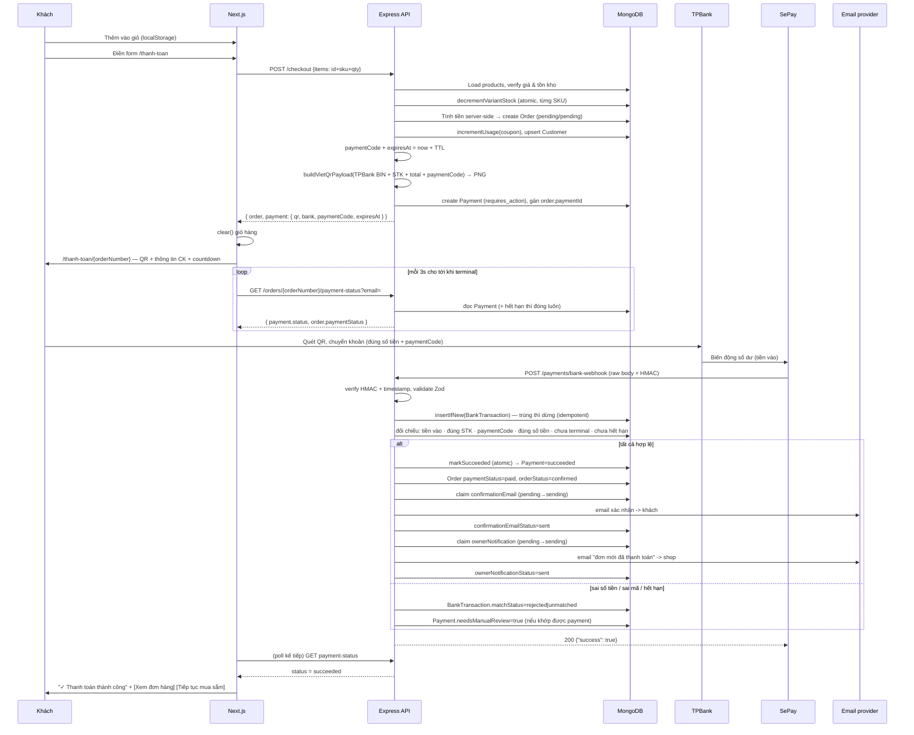
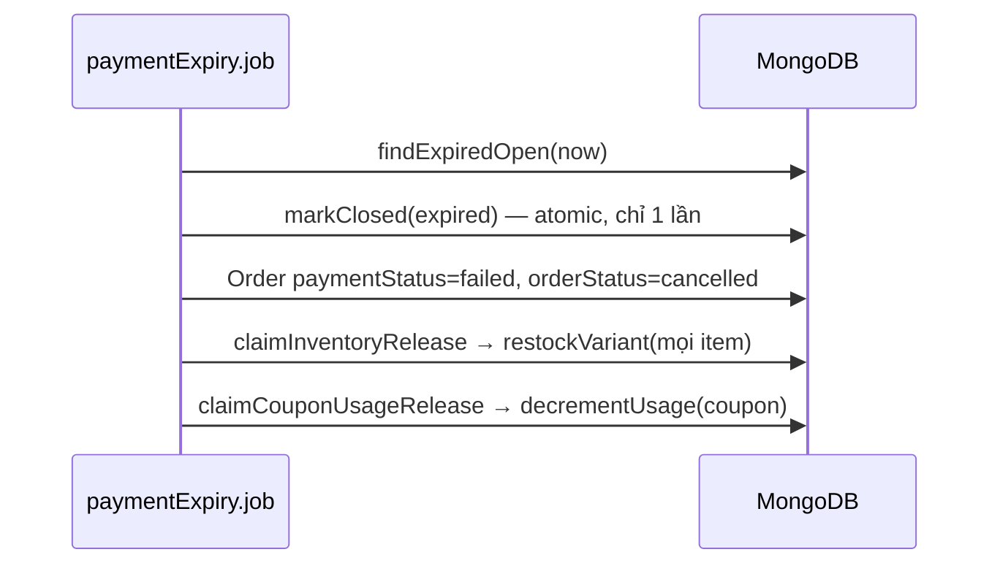
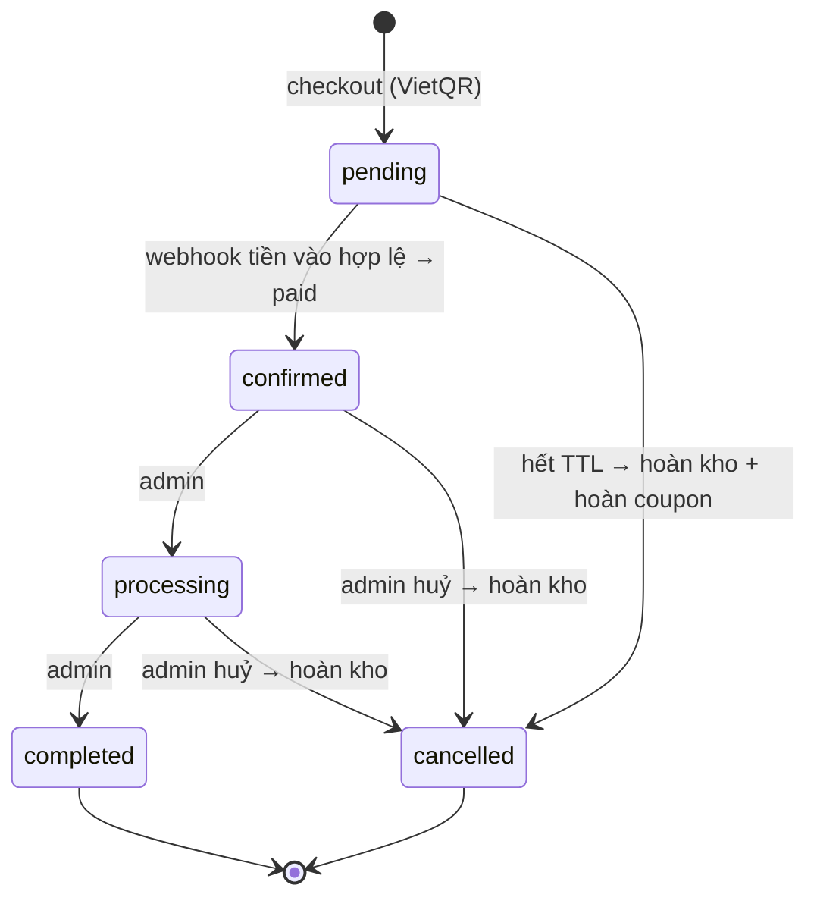

# LylaGlass — Tổng quan kỹ thuật toàn dự án

> Mục tiêu tài liệu: đọc xong hiểu được toàn bộ hệ thống như thể chính mình đã code từ đầu.
> Phạm vi: stack, kiến trúc, database, authentication, và **luồng đầy đủ** từ add-to-cart → checkout → thanh toán → webhook → đơn hàng → tồn kho → dòng tiền.
>
> Tài liệu liên quan: [REFERENCE_ANALYSIS.md](REFERENCE_ANALYSIS.md) (phân tích UI/UX của site tham chiếu — nguồn gốc của design tokens), [README.md](README.md) (hướng dẫn chạy).

---

## 1. Bức tranh tổng thể

LylaGlass là website thương mại điện tử bán ly thủy tinh, kiến trúc **decoupled**: một REST API độc lập và một Next.js app gọi API đó. Không dùng CMS/SaaS (Shopify chỉ là *tham chiếu thiết kế*, không phải nền tảng).

Ba đặc điểm định hình toàn bộ thiết kế:

1. **Guest-first** — khách không cần tài khoản để mua. Không có customer login. Chỉ **admin** mới có auth.
2. **Server-authoritative** — client gửi lên `productId + sku + quantity`; **giá, tồn kho, phí ship, giảm giá đều do backend tự tính lại**. Không bao giờ tin giá từ client.
3. **Provider-agnostic payment** — hai abstraction tách rời: `PaymentProvider` (tạo hướng dẫn thanh toán, hiện là `VietQRPaymentProvider`) và `BankNotificationProvider` (nhận thông báo tiền vào, hiện là `SePayBankNotificationProvider`). Đổi nhà cung cấp chỉ cần thêm 1 class, không đụng vào Order system.

Phương thức thanh toán duy nhất là **chuyển khoản ngân hàng qua VietQR** vào tài khoản TPBank của shop. Ranh giới quan trọng nhất của hệ thống:

> **VietQR chỉ tạo mã QR chuyển khoản. Việc xác nhận thanh toán dựa trên giao dịch tiền vào tài khoản TPBank thông qua webhook/IPN.** Khách mở/quét QR không phải là thanh toán. Frontend không bao giờ được quyền tuyên bố một đơn đã thanh toán.

```
┌──────────────────────┐        HTTP/JSON         ┌──────────────────────┐
│  Next.js 16 (App     │ ───────────────────────► │  Express 4 + TS      │
│  Router) :3000       │ ◄─────────────────────── │  REST API :4000      │
│  - Storefront (SSR)  │   polling payment-status │  Controller→Service  │
│  - Admin SPA (CSR)   │                          │  →Repository         │
└──────────────────────┘                          └──────────┬───────────┘
         │                                                    │ Mongoose
         │                                               ▼
         ▼                                         ┌──────────────────────┐
   Cloudinary CDN  ◄─── upload ảnh ────────────────│  MongoDB 7           │
                                                   └──────────────────────┘
                                                              ▲
   ┌───────────────┐   quét QR    ┌──────────┐               │ webhook tiền vào
   │  Khách hàng   │─────────────►│ TPBank   │──────────────► │ (SePay, đã ký HMAC)
   └───────────────┘  chuyển khoản└──────────┘   SePay theo   │
                                                 dõi biến động┘
```

---

## 2. Tech stack

### Backend — [backend/](backend/)

| Thành phần | Công nghệ | Ghi chú |
|---|---|---|
| Runtime / ngôn ngữ | Node.js + TypeScript 5.7 | `tsx watch` khi dev, `tsc` + `tsc-alias` khi build (alias `@/*` → `src/*`) |
| Web framework | Express 4.21 | |
| Database | MongoDB 7 + Mongoose 8 | Docker container `lylaglass-mongo` |
| Validation | Zod 3 | Schema đặt ở `validators/`, áp qua middleware `validate()` |
| Auth | `jsonwebtoken` + `bcryptjs` | JWT HS256, chỉ cho admin |
| Bảo mật | `helmet`, `cors`, `express-rate-limit` | Rate limit 300 req / 15 phút trên `/api` |
| Logging | `pino` + `pino-http` | `pino-pretty` khi dev |
| Upload ảnh | `multer` (memory) + Cloudinary SDK | Buffer → stream thẳng lên Cloudinary, không lưu đĩa |
| Sinh mã | `nanoid` | Order number + payment code (alphabet không có ký tự dễ nhầm) |
| QR thanh toán | `qrcode` | Render VietQR thành PNG data URI ngay trong process (không gửi STK cho dịch vụ ảnh bên thứ ba) |
| Email | Resend REST API qua `fetch` | Không thêm SDK; provider `log` ghi ra log khi dev |
| Test | Vitest 4 | `npm test`, alias `@/*` khớp tsconfig, repository được stub nên không cần DB |

### Frontend — [frontend/](frontend/)

| Thành phần | Công nghệ | Ghi chú |
|---|---|---|
| Framework | Next.js 16 (App Router) + React 19 | `next dev --webpack` (né lỗi Turbopack trên Windows) |
| Styling | Tailwind CSS v4 + shadcn/ui (`@base-ui/react`) | Design tokens trong [globals.css](frontend/src/app/globals.css) |
| Server state | TanStack Query v5 | Dùng ở phần client-side (admin, coupon, checkout mutation) |
| Client state | Zustand + `persist` | Giỏ hàng & admin session lưu localStorage |
| Form | react-hook-form + `@hookform/resolvers` + Zod | Cùng schema-style với backend |
| Toast | `sonner` | |
| Font | Playfair Display (heading) + Be Vietnam Pro (body) | `next/font/google`, có subset `vietnamese` |
| Icons | `lucide-react` | |

### Hạ tầng

- [docker-compose.yml](docker-compose.yml) — hiện chỉ chạy service `mongo:7` (volume `mongo-data`). Backend có [Dockerfile](backend/Dockerfile) riêng nhưng chưa được khai báo trong compose.
- Cấu hình qua biến môi trường, tập trung một chỗ tại [env.ts](backend/src/config/env.ts). Mẫu đầy đủ ở [backend/.env.example](backend/.env.example).

---

## 3. Kiến trúc backend: Controller → Service → Repository

Mỗi tầng có đúng một trách nhiệm, không nhảy cóc:

```
routes/          Khai báo URL + gắn middleware (validate, requireAdmin)
   ↓
middlewares/     validate (Zod) · requireAdmin (JWT) · upload (multer) · errorHandler
   ↓
controllers/     Bóc req → gọi service → sendSuccess/sendCreated. KHÔNG chứa logic.
   ↓
services/        Toàn bộ business logic: checkout, coupon, shipping, payment, order lifecycle.
   ↓
repositories/    Mọi truy vấn Mongoose. Tầng duy nhất được chạm vào Model.
   ↓
models/          Schema Mongoose + index + virtual.
```

Các tầng ngang được dùng xuyên suốt:

- **`payments/`** — hai abstraction tách biệt theo trách nhiệm:
  - [PaymentProvider.ts](backend/src/payments/PaymentProvider.ts) → tạo hướng dẫn thanh toán. `VietQRPaymentProvider` sinh payload VietQR ([vietqrPayload.ts](backend/src/payments/vietqrPayload.ts)) và render QR ([qrImage.ts](backend/src/payments/qrImage.ts)). **Không có hàm nào xác nhận thanh toán.**
  - [BankNotificationProvider.ts](backend/src/payments/BankNotificationProvider.ts) → xác thực + chuẩn hoá thông báo tiền vào. `SePayBankNotificationProvider` là nơi duy nhất biến một HTTP request thành một giao dịch đáng tin.
- **`email/`** — abstraction gửi email (`ResendEmailProvider`, `LogEmailProvider`), dùng bởi [email.service.ts](backend/src/services/email.service.ts).
- **`jobs/`** — [paymentExpiry.job.ts](backend/src/jobs/paymentExpiry.job.ts): quét payment quá hạn và gửi lại email thất bại.
- **`utils/`** — `ApiError` (lỗi có status code), `asyncHandler` (bắt lỗi async cho Express 4), `apiResponse` (chuẩn hoá response), `orderNumber` (sinh mã đơn), `paymentCode` (sinh/nhận dạng mã thanh toán).

### Vòng đời một request

1. `helmet` → `cors` (chỉ cho phép `CLIENT_ORIGIN`) → `compression` → `pino-http` → `rateLimit`.
   - Rate limit toàn cục **bỏ qua** hai đường có nhịp riêng: `/api/payments/*` (webhook — provider retry không được bị chặn) và `/api/orders/:orderNumber/payment-status` (polling 3s trong 15 phút sẽ đốt hết quota 300/15 phút). Mỗi đường có limiter riêng, xem [payment.routes.ts](backend/src/routes/payment.routes.ts) và [order.routes.ts](backend/src/routes/order.routes.ts).
2. **`/api/payments` được mount TRƯỚC `express.json()`** — xem [app.ts](backend/src/app.ts). Đây là chi tiết quan trọng: webhook cần **raw body** (Buffer) để verify chữ ký HMAC trên đúng byte gốc. Nếu JSON parse rồi serialize lại, chữ ký sẽ không khớp.
3. `express.json({ limit: "1mb" })` cho mọi route còn lại.
4. `/api/*` → [routes/index.ts](backend/src/routes/index.ts) → controller.
5. Lỗi rơi xuống [errorHandler](backend/src/middlewares/errorHandler.ts), map thành HTTP status:
   - `ZodError` → 400 kèm `details[{path, message}]`
   - `CastError` (ObjectId sai định dạng) → 400
   - Mongo duplicate key (`code 11000`) → 409
   - `ApiError` → status của chính nó
   - còn lại → 500 (kèm stack **chỉ khi không phải production**)

### Response contract (đồng nhất toàn API)

```jsonc
// thành công
{ "success": true, "data": <T>, "pagination"?: { page, limit, total, totalPages } }
// thất bại
{ "success": false, "error": { "message": "…", "details"?: [...] } }
```

Frontend bọc contract này trong [lib/api/client.ts](frontend/src/lib/api/client.ts) và ném `ApiClientError` (có `.status`, `.details`) nếu `success !== true`.

---

## 4. Database — 10 collections

Tất cả model dùng `{ timestamps: true }` (tự có `createdAt`/`updatedAt`).

### 4.1 Sơ đồ quan hệ



### 4.2 Chi tiết từng collection

**`Product`** — [Product.model.ts](backend/src/models/Product.model.ts)
Trung tâm của catalog. Điểm mấu chốt: **variants là subdocument array nhúng thẳng vào product**, không tách collection riêng.

```ts
{
  name, slug (unique, index), shortDescription, description,
  categoryId → Category, vendor,
  images: [{ url, alt, position }],
  variants: [{                 // bắt buộc ≥ 1 (validator)
    sku, name,                 // vd "Dung tích 300ml"
    attributes: Map<string,string>,
    price, compareAtPrice,
    inventoryQty,              // ← TỒN KHO NẰM Ở ĐÂY, theo từng SKU
    imageUrl, weight
  }],
  optionName,                  // nhãn của variant selector, vd "Dung tích"
  tags[], material, capacity, features[], careInstructions[],
  status: draft|active|archived,
  isFeatured, isBestseller, isNewArrival,
  ratingAverage, reviewCount,  // denormalize từ Review để khỏi aggregate mỗi lần render
  seoTitle, seoDescription
}
```
- Index: `{ name, shortDescription, tags }` **text index** (phục vụ search `$text`), và compound `{ categoryId, status, createdAt }`.
- Virtual (serialize kèm JSON): `minPrice`, `maxCompareAtPrice`, `totalInventory`.

**`Category`** — `name`, `slug` (unique), `description`, `image`, `sortOrder`, SEO fields, `isActive`. Seed tạo 3 danh mục: `gifting` (Quà Tặng), `seasonal` (Theo Mùa), `daily-moods` (Tâm Trạng Mỗi Ngày).

**`Order`** — [Order.model.ts](backend/src/models/Order.model.ts) — model quan trọng nhất.

```ts
{
  orderNumber,                  // unique, dạng LG20260817-K7M2XQ
  customer: { customerId?, name, email, phone },   // customerId nullable → guest
  shippingAddress, billingAddress,                 // embedded, VN-style: line1/ward/district/province
  items: [{                     // SNAPSHOT tại thời điểm mua
    productId, productName, slug, image,
    sku, variantName, variantAttributes,
    quantity, unitPrice, compareAtPrice, lineTotal
  }],
  subtotal, shippingFee, discountTotal, couponCode, total, currency: "VND",
  customerNote,
  paymentMethod: bank_transfer,  // enum chỉ còn 1 giá trị (VietQR)
  paymentId → Payment,
  paymentStatus:  pending | paid | failed | refunded          (index)
  orderStatus:    pending | confirmed | processing | completed | cancelled  (index)
  shippingStatus: unfulfilled | processing | shipped | delivered | returned (index)
  shippingCarrier, trackingNumber,
  inventoryReleased: bool,      // cờ chống hoàn kho 2 lần
  couponUsageReleased: bool     // cờ chống hoàn lượt coupon 2 lần
}
```

> **Vì sao hai cờ release riêng?** Tồn kho và lượt dùng coupon đều được "trừ" ở checkout và phải được trả lại khi đơn không được thanh toán. Mỗi cờ được claim bằng một `findOneAndUpdate` có điều kiện (`inventoryReleased: false` → `true`) nên chỉ **một** caller thắng: webhook retry, job hết hạn, và admin huỷ đơn có thể chạy đồng thời mà không bao giờ hoàn kho/coupon hai lần.

> **Vì sao snapshot?** `items[]` copy tên/ảnh/giá tại thời điểm đặt. Sau này admin đổi giá hay xoá sản phẩm, đơn cũ vẫn nguyên vẹn. Đơn hàng **không bao giờ** join ngược lại Product để tính tiền.

> **Vì sao 3 status tách rời?** Tiền, quy trình xử lý, và vận chuyển là ba trục độc lập. Một đơn có thể `paymentStatus=paid` + `orderStatus=processing` + `shippingStatus=unfulfilled` cùng lúc — gộp thành một enum sẽ nổ tổ hợp.

**`Payment`** — [Payment.model.ts](backend/src/models/Payment.model.ts)

```ts
{
  orderId → Order (index),
  provider: vietqr,
  intentId (index),             // = paymentCode (VietQR không có session bên ngoài)
  idempotencyKey (unique),      // = `checkout_<orderId>` → 1 order chỉ tạo được 1 payment
  amount, currency,
  status: requires_action | processing | succeeded | failed | expired | refunded (index),
  method: bank_transfer,

  // VietQR — toàn bộ do server sinh
  paymentCode (unique, uppercase),  // nội dung chuyển khoản, khoá đối soát duy nhất
  bankBin, bankCode, bankName, bankAccountNumber, bankAccountName,
  qrPayload,                    // chuỗi EMVCo/VietQR mà QR mã hoá
  expiresAt (index),            // = createdAt + PAYMENT_TTL_MINUTES
  paidAt,

  // Giao dịch ngân hàng đã khớp
  transactionId,                // unique (partial index) → webhook trùng bị DB từ chối
  referenceCode, transactionDate, transferredAmount,

  failureReason,
  needsManualReview: bool,      // sai số tiền / tiền về sau hạn → admin xử lý
  manualReviewReason,

  // Idempotency + hiển thị cho admin. TÁCH RIÊNG cho từng loại email, nên một
  // email lỗi không chặn/gửi lại email kia. Tên field = <kind> + Status/SentAt/
  // Attempts/Error, dùng chung một bộ helper atomic trong payment.repository.
  confirmationEmailStatus: pending | sending | sent | failed (index),      // gửi khách
  confirmationEmailSentAt, confirmationEmailAttempts, confirmationEmailError,
  ownerNotificationStatus: pending | sending | sent | failed | skipped (index), // gửi shop
  ownerNotificationSentAt, ownerNotificationAttempts, ownerNotificationError,
  //   skipped = chưa cấu hình ORDER_NOTIFICATION_EMAILS -> ghi 1 lần để job
  //             retry không quét lại mãi

  rawEvent: Mixed               // lưu nguyên payload webhook để đối soát/debug
}
```

> **`transactionId` dùng partial unique index**: `{ unique: true, partialFilterExpression: { transactionId: { $type: "string" } } }`. Nếu unique thường, mọi payment đang chờ (chưa có `transactionId`) sẽ đụng nhau ở giá trị `null`.

**`BankTransaction`** — [BankTransaction.model.ts](backend/src/models/BankTransaction.model.ts)

Sổ ghi **mọi** thông báo tiền vào nhận được, kể cả giao dịch không khớp đơn nào. Tồn tại vì hai việc Payment không làm được:

1. **Idempotency tại nguồn** — unique index `(provider, providerTransactionId)` từ chối webhook trùng **trước khi** bất kỳ business logic nào chạy, kể cả với giao dịch không match payment.
2. **Đối soát** — giao dịch sai nội dung/sai số tiền/đến sau hạn không có Payment hợp lệ để gắn vào, nhưng admin vẫn phải thấy được.

```ts
{
  provider: sepay,
  providerTransactionId,        // unique cùng provider
  gateway, accountNumber, subAccount,
  transferType: in | out, transferAmount, accumulated,
  code, content, description, referenceCode, transactionDate,
  matchStatus: matched | unmatched | rejected | ignored (index),
  matchNote, paymentId → Payment, orderId → Order, resolvedAt,
  rawPayload: Mixed
}
```

**`Customer`** — được tạo **lazily** từ thông tin checkout, match theo `email` (unique). Không có password, không login. Chỉ để admin nhận diện khách quay lại: `ordersCount`, `totalSpent` được `$inc` mỗi lần đặt hàng.

**`Coupon`** — `code` (unique, uppercase), `type: percentage|fixed|free_shipping`, `value`, `minimumSubtotal`, `maxDiscountAmount`, `usageLimit`/`usageCount`, `startsAt`/`endsAt`, `isActive`.

**`Review`** — `productId`, `rating (1-5)`, `authorName`, `title`, `body`, `isVerifiedPurchase`, `isApproved` (mặc định `true` — tức auto-publish).

**`AdminUser`** — `name`, `email` (unique), `passwordHash` (bcrypt cost 10), `role: owner|staff`, `isActive`, `lastLoginAt`.

**`Settings`** — **singleton** (một document duy nhất, khoá bởi `key: "store"`). Chứa `freeShippingThreshold` (490.000đ), `flatShippingFee` (30.000đ), `storeName`, `supportEmail`, `supportPhone`. Repository dùng `findOneAndUpdate(..., { upsert: true })` nên luôn tồn tại kể cả DB trống.

---

## 5. Authentication & Authorization

### 5.1 Khách hàng: KHÔNG có auth

Đây là quyết định thiết kế, không phải thiếu sót. Guest checkout hoàn toàn:

- Giỏ hàng nằm ở **localStorage** (Zustand `persist`, key `lylaglass-cart`) — không có server-side cart, không session.
- Tra cứu đơn hàng dùng cặp **`orderNumber` + `email`** làm "mật khẩu yếu": [`getOrderForCustomer`](backend/src/services/order.service.ts) chỉ trả đơn khi email khớp (so sánh case-insensitive). Route: `GET /api/orders/lookup/:orderNumber?email=…`.
- Trang xác nhận đơn `/don-hang/[orderNumber]?email=…` gắn `robots: { index: false }` để không lọt vào search engine.

### 5.2 Admin: JWT Bearer

```
POST /api/admin/auth/login  { email, password }
   → bcrypt.compare(password, admin.passwordHash)
   → jwt.sign({ sub: adminId, role }, JWT_SECRET, { expiresIn: "7d" })
   → { token, admin: { id, name, email, role } }
```

Mọi route admin đi qua [`requireAdmin`](backend/src/middlewares/adminAuth.ts):
1. Đọc header `Authorization: Bearer <token>`.
2. `jwt.verify` với `JWT_SECRET`.
3. **Query lại DB** kiểm tra admin còn tồn tại và `isActive` — nên vô hiệu hoá tài khoản có hiệu lực ngay, không cần chờ token hết hạn.
4. Gắn `req.admin = { sub, role }`.

`requireRole("owner")` là lớp thứ hai, dùng cho các thao tác nhạy cảm: xoá category, sửa Settings.

**Phía frontend**: token lưu trong Zustand persist (`lylaglass-admin-auth` → localStorage). [`useAdminGuard`](frontend/src/hooks/use-admin-guard.ts) đợi hydrate xong rồi redirect về `/quan-tri/dang-nhap` nếu không có token. Vì token ở localStorage nên **toàn bộ admin panel là client-side render** — middleware/SSR không đọc được nó.

> **Đánh đổi đã biết**: localStorage dễ bị XSS hơn httpOnly cookie. Chấp nhận được cho admin panel nội bộ; nếu siết bảo mật thì chuyển sang httpOnly cookie + CSRF token.

---

## 6. API surface

Base: `http://localhost:4000/api` · 🔓 công khai · 🔐 cần admin JWT · 👑 cần role `owner`

| Method | Endpoint | | Mô tả |
|---|---|---|---|
| GET | `/categories` | 🔓 | Danh mục đang active |
| GET | `/categories/:idOrSlug` | 🔓 | Chi tiết danh mục |
| POST/PATCH/DELETE | `/categories…` | 🔐/👑 | CRUD (delete cần owner) |
| GET | `/products` | 🔓 | List + filter: `page,limit,category,q,sort,minPrice,maxPrice,tag,inStockOnly` |
| GET | `/products/:slug` | 🔓 | PDP — trả `{ product, related[4] }` |
| GET/POST | `/products/:productId/reviews` | 🔓 | Đọc & viết đánh giá |
| POST/PATCH/DELETE | `/products…` | 🔐 | CRUD sản phẩm |
| PATCH | `/products/:id/inventory` | 🔐 | Set `inventoryQty` cho 1 SKU |
| POST | `/products/upload-image` | 🔐 | multipart → Cloudinary |
| **POST** | **`/checkout`** | 🔓 | **Tạo đơn + Payment + VietQR — trái tim hệ thống** |
| **POST** | **`/payments/bank-webhook`** | 🔓* | **Thông báo tiền vào TPBank** (*xác thực bằng HMAC/API key của SePay, không phải JWT) |
| **GET** | **`/orders/:orderNumber/payment-status?email=&includeQr=`** | 🔓 | **Trạng thái thanh toán realtime** (FE polling; `no-store`, limiter riêng) |
| GET | `/orders/lookup/:orderNumber?email=` | 🔓 | Tra cứu đơn |
| GET/PATCH/POST | `/orders/admin…` | 🔐 | List, chi tiết (kèm `payment`), đổi status, huỷ đơn |
| GET | `/payments/admin/bank-transactions` | 🔐 | Sổ giao dịch tiền vào để đối soát |
| POST | `/coupons/validate` | 🔓 | Kiểm tra mã trước khi đặt |
| GET/POST/PATCH/DELETE | `/coupons/admin…` | 🔐 | CRUD mã giảm giá |
| GET | `/customers/admin/all`, `/customers/admin/:id` | 🔐 | Danh sách khách |
| GET | `/admin/dashboard` | 🔐 | Thống kê tổng hợp |
| GET | `/settings` | 🔓 | Ngưỡng freeship, phí ship, thông tin liên hệ |
| PATCH | `/settings` | 👑 | Sửa settings |
| GET | `/health` | 🔓 | Healthcheck (ngoài `/api`, không rate-limit) |

Sort options của `/products`: `featured | newest | price_asc | price_desc | name_asc | name_desc | bestselling`.

---

## 7. LUỒNG ĐẦY ĐỦ: Add to cart → Checkout → Thanh toán → Đơn hàng

### 7.1 Giai đoạn 1 — Add to cart (100% client-side)

Không có API call nào trong bước này.

1. Trang PDP `/san-pham/[slug]` là **Server Component**, fetch product từ API lúc render (bao gồm `variants[].inventoryQty`).
2. [`PurchasePanel`](frontend/src/components/product-detail/purchase-panel.tsx) là Client Component: chọn variant → `useCartStore.addItem()`.
3. Item lưu vào Zustand kèm **`maxQuantity = variant.inventoryQty`** (snapshot tồn kho lúc xem trang). Store tự clamp `quantity ≤ maxQuantity`.
4. `addItem` set `isDrawerOpen = true` → Cart Drawer tự trượt ra.
5. Zustand `persist` ghi xuống localStorage key `lylaglass-cart`.

> `maxQuantity` chỉ là **UX guard**, không phải cơ chế bảo vệ. Tồn kho thật được kiểm tra lại và khoá atomic ở bước checkout — client có sửa localStorage cũng vô ích.

### 7.2 Giai đoạn 2 — Checkout

Trang [/thanh-toan](frontend/src/app/(storefront)/thanh-toan/page.tsx) (Client Component):

- Form validate bằng react-hook-form + Zod: họ tên, email, SĐT, địa chỉ (line1/line2/ward/district/province), ghi chú. **Không còn lựa chọn phương thức thanh toán** — chỉ hiển thị thông tin "Chuyển khoản ngân hàng (VietQR)".
- Áp mã giảm giá gọi trước `POST /coupons/validate` để **preview** số tiền giảm (không lưu gì cả).
- Submit → `POST /api/checkout` với payload **chỉ chứa `{ productId, sku, quantity }`** — không gửi giá.

Backend [`processCheckout`](backend/src/services/checkout.service.ts) chạy 5 bước:

```
① LOAD & VALIDATE
   Với mỗi item: load Product từ DB.
   - product tồn tại & status === "active"?  không → 400
   - variant có sku đó?                      không → 400
   - inventoryQty >= quantity?               không → 409 (kèm { sku, available })
   Dựng lineItems[] với giá LẤY TỪ DB (variant.price), tính lineTotal.

② RESERVE STOCK (atomic, tuần tự từng SKU)
   productRepository.decrementVariantStock():
     findOneAndUpdate(
       { _id, variants: { $elemMatch: { sku, inventoryQty: { $gte: quantity } } } },
       { $inc: { "variants.$[v].inventoryQty": -quantity } },
       { arrayFilters: [{ "v.sku": sku }] }
     )
   Filter + update là MỘT thao tác atomic ở tầng document của MongoDB
   → hai checkout đồng thời cùng SKU KHÔNG THỂ cùng thành công vượt quá tồn kho.
   Trả null = hết hàng → rollback toàn bộ SKU đã trừ trước đó (releaseReservedStock)
                       → ném 409 "vừa hết hàng, vui lòng thử lại".

③ TÍNH TIỀN (server-side, tuyệt đối)
   subtotal      = Σ lineTotal
   discountTotal = evaluateCoupon(code, subtotal)   // kiểm tra lại hạn, lượt, min subtotal
                   percentage → round(subtotal*value/100), cap bởi maxDiscountAmount
                   fixed      → min(value, subtotal)
                   free_shipping → discount = 0, freeShipping = true
   shippingFee   = freeShipping ? 0
                 : subtotal >= settings.freeShippingThreshold ? 0
                 : settings.flatShippingFee
   total         = max(subtotal - discountTotal + shippingFee, 0)

④ TẠO ĐƠN
   orderNumber = "LG" + YYYYMMDD + "-" + nanoid(6, bảng chữ không nhập nhằng: bỏ 0/O/1/I)
   orderStatus = "pending"        ← luôn chờ tiền; không có nhánh nào tin ngay
   paymentStatus = "pending"
   paymentMethod = "bank_transfer"
   → couponRepository.incrementUsage()     // nếu có mã (ngay sau khi Order tồn tại)
   → customerRepository.upsertFromOrder()  // upsert Customer theo email, $inc ordersCount/totalSpent

⑤ TẠO PAYMENT + VIETQR  (createPaymentForOrder)
   paymentCode = "LG" + nanoid(6)          ← duy nhất, unique index
   expiresAt   = now + PAYMENT_TTL_MINUTES ← TÍNH TỪ SERVER, không phải từ FE
   provider.createPaymentIntent(...)
     → buildVietQrPayload({ bankBin: 970423, accountNumber, amount: total, description: paymentCode })
     → render QR thành PNG data URI
   → tạo Payment { status: "requires_action", paymentCode, expiresAt, qrPayload,
                   idempotencyKey: `checkout_<orderId>` }   ← 1 order = 1 payment
   → order.paymentId = payment._id
   → return { order, payment: <public view + qrCodeDataUrl> }
```

`status = "requires_action"` chứ không phải `processing`: tiền chưa hề di chuyển, hệ thống đang chờ **khách** hành động.

Toàn bộ bước ③④⑤ nằm trong `try/catch`. Nếu lỗi xảy ra **trước khi** Order được ghi → `releaseReservedStock()` hoàn kho trực tiếp. Nếu lỗi xảy ra **sau khi** Order đã tồn tại → đơn được đánh `cancelled` và hoàn kho/coupon qua `releaseOrderReservations()` (đường có cờ), để job hết hạn hoặc admin sau này không hoàn kho lần thứ hai.

Frontend nhận kết quả → `clear()` giỏ (đơn đã sống server-side) → điều hướng `/thanh-toan/{orderNumber}?email=…`.

### 7.3 Giai đoạn 3 — Thanh toán & Webhook

Trang [/thanh-toan/[orderNumber]](frontend/src/app/(storefront)/thanh-toan/[orderNumber]/payment-content.tsx) hiển thị QR + thông tin chuyển khoản dạng text (có nút copy) + countdown, và **poll** `GET /orders/:orderNumber/payment-status` mỗi 3 giây:

- Dừng polling khi payment vào trạng thái terminal (`succeeded | failed | expired | refunded`), khi component unmount, và không bao giờ chạy vô hạn.
- Countdown tính từ `expiresAt` **do backend trả về** — không dùng `setTimeout(15 phút)` phía client, vì reload trang sẽ làm sai TTL.
- `includeQr=true` chỉ ở lần fetch đầu (và sau reload); các lần poll sau không render lại QR để tiết kiệm CPU.
- Nút **"Tôi đã chuyển khoản"** chỉ `refetch()` — nó *hỏi* backend, không *khai báo* đã trả tiền.
- Nếu khách đóng tab: webhook vẫn về, đơn vẫn được xác nhận, email vẫn được gửi.

Khi khách chuyển khoản, SePay phát hiện biến động số dư TPBank và POST tới `/api/payments/bank-webhook`. [`handleBankWebhook`](backend/src/services/payment.service.ts):

```
1. provider.verifyAndParse(rawBody, headers)          ← SePayBankNotificationProvider
   HMAC mode (khuyến nghị):
     expected = "sha256=" + HMAC_SHA256(secret, `${X-SePay-Timestamp}.${rawBody}`)
     so sánh constant-time với header X-SePay-Signature
     + kiểm tra timestamp trong khoảng ±BANK_WEBHOOK_TIMESTAMP_TOLERANCE_SECONDS (chống replay)
   API key mode: header `Authorization: Apikey <key>`, so sánh constant-time
     ⇒ ĐÂY LÀ LÝ DO route này mount trước express.json(): chữ ký ký trên byte gốc
   → validate payload bằng Zod → chuẩn hoá thành BankTransactionEvent
   → transactionDate parse theo giờ Việt Nam (UTC+7), không phải UTC
   Sai chữ ký → 401 (SePay sẽ retry). Sai schema → 400.

2. GHI SỔ TRƯỚC KHI XỬ LÝ (bankTransactionRepository.insertIfNew)
   unique index (provider, providerTransactionId) → insert trùng trả null
   → return { duplicate: true }, KHÔNG chạy business logic.
   Đây là lớp chống webhook trùng ở tầng database, đúng cho cả trường hợp
   giao dịch không khớp đơn nào. (SePay retry tối đa 7 lần / 5 giờ.)

3. ĐỐI CHIẾU (reconcileTransaction) — chỉ khớp khi TẤT CẢ điều kiện đúng:
   (a) transferType === "in"                → ngược lại: ignored
   (b) accountNumber (hoặc subAccount) === VIETQR_ACCOUNT_NUMBER  → sai: rejected
   (c) trích paymentCode từ code/content/description (regex /LG[2-9A-HJ-NP-Z]{6}/)
       rồi TRA DB theo từng ứng viên          → không thấy: unmatched
       ⚠ KHÔNG BAO GIỜ tìm đơn theo số tiền: hai đơn cùng 200.000đ là chuyện thường.
   (d) payment chưa terminal                 → đã succeeded: ignored
                                             → đã expired/failed: rejected + needsManualReview
   (e) transferAmount === payment.amount      → thiếu HOẶC thừa: rejected + needsManualReview
   (f) transactionDate <= payment.expiresAt   → muộn: rejected + needsManualReview

4. CHỐT (settlePayment) — atomic:
   paymentRepository.markSucceeded() dùng findOneAndUpdate với điều kiện
     { _id, status: { $nin: [succeeded, failed, expired, refunded] } }
   → hai webhook song song thì chỉ MỘT thắng, kẻ thua nhận null và dừng.
   → Order: paymentStatus = "paid", orderStatus "pending" → "confirmed"
     (KHÔNG trừ kho lần nữa — kho đã giữ từ checkout)
   → gửi 2 email, mỗi loại claim atomic riêng (<kind>Status pending|failed →
     sending) nên chỉ một caller gửi được:
       deliverConfirmationEmail()  -> email xác nhận cho khách
       deliverOwnerNotification()  -> email "đơn mới đã thanh toán" cho shop
     Cả hai đều bọc try/catch riêng: một email lỗi không chặn email kia, và
     không email nào làm rollback payment.

5. Luôn trả 200 {"success": true} cho request đã tiếp nhận (kể cả rejected/
   unmatched), vì SePay coi mọi thứ khác là thất bại và sẽ retry vô ích.
   Chỉ 401 (sai xác thực) và 5xx (lỗi thật) mới nên khiến provider gửi lại.
```

**Hết hạn (TTL)** — [`expirePayment`](backend/src/services/payment.service.ts) được gọi từ hai nơi: job định kỳ [paymentExpiry.job.ts](backend/src/jobs/paymentExpiry.job.ts) (mặc định 60s/lần — cần thiết cho khách đã đóng tab) và ngay trong endpoint `payment-status` (để khách đang mở trang thấy đúng trạng thái tức thì). Cả hai đi qua cùng một atomic transition nên không đụng nhau:

```
markClosed(id, "expired") với điều kiện status chưa terminal
  → thắng: Order paymentStatus="failed", orderStatus="cancelled"
           + releaseOrderReservations(): hoàn kho (cờ inventoryReleased)
                                         + hoàn lượt coupon (cờ couponUsageReleased)
  → thua (đã paid/expired): trả null, không làm gì
```

**Quy tắc business đã chọn cho hai ca khó** (cố ý *không* tự động xác nhận):

| Tình huống | Xử lý | Vì sao |
|---|---|---|
| Chuyển **thừa** tiền | không paid, `needsManualReview` | chưa có quy tắc xử lý phần dư; admin quyết định hoàn hay chấp nhận |
| Tiền về **sau** khi payment hết hạn | không paid, `needsManualReview` | kho đã hoàn và đơn đã huỷ; tự động xác nhận có thể bán vượt tồn kho |

### 7.4 Sequence diagram — luồng thanh toán VietQR / TPBank



**Nếu khách không chuyển khoản:**



### 7.5 "Đơn tự động được tạo như nào?"

Đơn được tạo **đồng bộ ngay trong request `POST /checkout`** — trước cả khi khách mở app ngân hàng. Lý do:

- Cần **giữ chỗ tồn kho** trước, nếu không khách chuyển tiền xong mới phát hiện hết hàng.
- Cần **`orderId`** và **`paymentCode`** để làm khoá đối soát — webhook sau này chỉ có nội dung chuyển khoản để tra ngược về đơn.

Cái được "tự động" là **chuyển trạng thái đơn**, do webhook (hoặc job hết hạn) kích hoạt, chứ không phải việc tạo đơn.

Có **một** background job duy nhất: [paymentExpiry.job.ts](backend/src/jobs/paymentExpiry.job.ts) chạy mỗi `PAYMENT_EXPIRY_SWEEP_INTERVAL_MS` để (1) đóng payment quá hạn và hoàn kho/coupon, (2) gửi lại email xác nhận thất bại (tối đa `EMAIL_MAX_ATTEMPTS` lần). Job dùng `setInterval(...).unref()` nên không giữ process sống.

Máy trạng thái đầy đủ:



`orderStatus=completed` **không thể** huỷ ([order.service.ts](backend/src/services/order.service.ts) chặn bằng 400).

### 7.6 "Tiền chuyển về ngân hàng như nào?"

Khác với mô hình cổng thanh toán, ở đây **tiền về trực tiếp tài khoản TPBank của shop, không qua trung gian giữ tiền, không có phí gateway, không có chu kỳ payout T+n**. Hệ thống cũng không bao giờ thấy số thẻ — nó chỉ thấy *thông báo* rằng một khoản tiền đã vào tài khoản.

```
Khách quét VietQR → App ngân hàng của khách → NAPAS 247
   → Tiền vào tài khoản TPBank của shop  (tức thời, 24/7)
   → SePay (đã liên kết API Banking với TPBank) phát hiện biến động số dư
   → POST webhook đã ký HMAC tới backend
   → backend đối soát và đánh dấu paymentStatus = paid
```

SePay là **lớp thông báo**, không phải lớp giữ tiền: nó không bao giờ nắm tiền của shop, chỉ đọc và đẩy biến động số dư. Vì vậy rủi ro tài chính của tích hợp này là rủi ro *thông tin* (webhook trễ/mất → đơn chưa được xác nhận), không phải rủi ro *dòng tiền*. Chống mất webhook: SePay tự retry (tối đa 7 lần / 5 giờ), và mọi giao dịch nhận được đều được ghi vào `BankTransaction` nên admin luôn đối soát được bằng tay tại trang **Quản trị → Thanh toán**.

**Hai vai trò tách biệt** (đừng nhập nhằng):

| | Trách nhiệm | Implementation | Có thể tuyên bố "đã trả tiền"? |
|---|---|---|---|
| `PaymentProvider` | tạo mã VietQR + thông tin chuyển khoản | `VietQRPaymentProvider` | **Không** |
| `BankNotificationProvider` | nhận + xác thực giao dịch tiền vào | `SePayBankNotificationProvider` | **Có** (đường duy nhất) |

Đổi sang nhà cung cấp thông báo khác (ví dụ Casso) chỉ cần thêm một class implement `BankNotificationProvider` và đăng ký trong [payments/index.ts](backend/src/payments/index.ts) — **không sửa một dòng nào trong Order/Checkout service**. Đổi ngân hàng nhận tiền chỉ là đổi `VIETQR_BANK_BIN`/`VIETQR_ACCOUNT_NUMBER` trong `.env`.

**Về chuẩn VietQR**: payload là TLV theo EMVCo + trường riêng của NAPAS (tag 38 với GUID `A000000727`, service code `QRIBFTTA`), CRC-16/CCITT-FALSE tính trên toàn bộ chuỗi **bao gồm** cả `6304`. BIN của TPBank là **970423** (khác với mã ngắn `TPB`). Implementation ở [vietqrPayload.ts](backend/src/payments/vietqrPayload.ts) được kiểm chứng bằng test đối chiếu với một payload tham chiếu đã công bố, byte-for-byte.

### 7.7 Nhất quán tồn kho — tóm tắt

| Tình huống | Cơ chế |
|---|---|
| 2 khách mua SKU cuối cùng cùng lúc | `findOneAndUpdate` với điều kiện `inventoryQty >= quantity` trong filter — atomic ở tầng document, chỉ 1 người thắng |
| Cart có 3 item, item thứ 3 hết hàng | `releaseReservedStock()` hoàn lại 2 item đã trừ, ném 409 |
| Lỗi bất kỳ sau khi trừ kho, **trước** khi Order tồn tại | `catch` → `releaseReservedStock()` → ném lại lỗi |
| Lỗi sau khi Order đã tồn tại (ví dụ sinh QR lỗi) | `catch` → Order `cancelled` + `releaseOrderReservations()` (đường có cờ) |
| Khách không chuyển khoản (hết TTL) | `expirePayment()` → hoàn kho + hoàn lượt coupon, mỗi thứ đúng 1 lần |
| Thanh toán thành công | **KHÔNG** trừ kho lần nữa — kho đã giữ từ checkout |
| Admin huỷ đơn | `cancelOrder()` → `releaseOrderReservations()` |
| Webhook gửi lặp / job hết hạn chạy đè / admin huỷ đơn đã huỷ | `insertIfNew` (unique transactionId) + transition atomic trên Payment + cờ `inventoryReleased`/`couponUsageReleased` claim atomic → không bao giờ hoàn 2 lần |

**Coupon**: lượt dùng được `$inc` ngay ở checkout (để chặn vượt `usageLimit` khi nhiều khách đặt cùng lúc), nên bắt buộc phải hoàn lại khi đơn không được thanh toán — `decrementUsage` có điều kiện `usageCount > 0` để không bao giờ âm.

> **Hạn chế đã biết**: MongoDB transaction (multi-document) **không** được dùng. Trừ kho tuần tự từng SKU + rollback thủ công là "compensating transaction" chứ không phải ACID thật. Nếu process crash đúng giữa vòng lặp reserve, một phần kho sẽ bị giữ vĩnh viễn (job hết hạn chỉ dọn được kho của những Order đã kịp tạo Payment). Muốn chặt chẽ hơn thì cần replica set + `session.withTransaction()`.

---

## 8. Frontend

### 8.1 Cấu trúc route

Toàn bộ URL đặt bằng **tiếng Việt không dấu**, có ý nghĩa SEO.

**Storefront** — [src/app/(storefront)/](frontend/src/app/(storefront)/), dùng route group `(storefront)` nên `(storefront)` không xuất hiện trong URL. Layout dùng chung: AnnouncementBar → Header → `{children}` → Footer → CartDrawer.

| Route | Render | Mô tả |
|---|---|---|
| `/` | Server | Homepage: hero, marquee, category grid, product sections, about, FAQ, contact, newsletter |
| `/san-pham` | Server | Tất cả sản phẩm + filter/sort/pagination |
| `/san-pham/[slug]` | Server | PDP + JSON-LD `Product` schema + `generateMetadata` động |
| `/danh-muc/[slug]` | Server | PLP theo danh mục |
| `/tim-kiem` | Server | Kết quả tìm kiếm (`$text` search) |
| `/gio-hang` | Client | Trang giỏ hàng đầy đủ |
| `/thanh-toan` | Client | Form checkout (không còn chọn phương thức — chỉ VietQR) |
| `/thanh-toan/[orderNumber]` | Server shell + Client | **Trang thanh toán VietQR**: QR, thông tin CK, countdown theo `expiresAt`, polling trạng thái, success state (`noindex`) |
| `/don-hang/[orderNumber]` | Server (`force-dynamic`) | Xác nhận đơn (`noindex`), luôn đọc trạng thái mới nhất |
| `/tra-cuu-don-hang` | Client | Tra cứu bằng mã đơn + email |
| `/gioi-thieu`, `/lien-he`, `/cau-hoi-thuong-gap` | Server | Trang tĩnh |

**Admin** — [src/app/quan-tri/](frontend/src/app/quan-tri/), toàn bộ **client-side** (vì token ở localStorage), layout Sidebar + Topbar, bọc bởi `useAdminGuard`.

`/quan-tri` (dashboard) · `/dang-nhap` · `/san-pham` + `/moi` + `/[id]` · `/danh-muc` · `/don-hang` + `/[id]` · `/khach-hang` · `/ma-giam-gia` · `/ton-kho` · `/van-chuyen` · `/thanh-toan`

### 8.2 Chiến lược render & data fetching

- **Storefront = Server Components**: gọi `apiClient` trực tiếp từ server, HTML đến browser đã có nội dung → tốt cho SEO. Chỉ những gì cần tương tác (`PurchasePanel`, `CartDrawer`, form) mới là Client Component.
- **Admin = Client Components + TanStack Query**: cần token trong localStorage.
- **Fail-soft**: storefront layout bọc `getLayoutData()` trong `try/catch` với `FALLBACK_SETTINGS` — API chết thì trang vẫn render được khung.
- **Dữ liệu thanh toán tuyệt đối không cache**: `paymentsApi.getStatus` và `ordersApi.lookup` dùng `cache: "no-store"`; trang `/don-hang/[orderNumber]` khai báo `export const dynamic = "force-dynamic"`; backend trả `Cache-Control: no-store` cho endpoint payment-status. Một response cũ ở đây nghĩa là khách đã trả tiền mà vẫn thấy "chờ thanh toán".
- SEO: `sitemap.ts` + `robots.ts` sinh động, `generateMetadata` per-page, JSON-LD trên PDP. Trang thanh toán và đơn hàng đều `noindex`.

### 8.3 State

| State | Nơi lưu | Key |
|---|---|---|
| Giỏ hàng | Zustand + persist | `lylaglass-cart` (localStorage) |
| Admin session | Zustand + persist | `lylaglass-admin-auth` (localStorage) |
| Server data (admin) | TanStack Query cache | in-memory |
| Server data (storefront) | fetch trong Server Component | Next.js cache |

### 8.4 Design system

Tokens trong [globals.css](frontend/src/app/globals.css) dùng **oklch**, kế thừa từ phân tích site tham chiếu (REFERENCE_ANALYSIS §7):

- Nền kem ấm · primary **dusty rose** · secondary **mint** · **coral** cho badge sale · chữ nâu-xám.
- **Button `radius: 40px` (pill) nhưng input `radius: 6px`** — đây là chủ ý, hai token tách biệt, không dùng chung.
- Product card `radius: 1rem`, media `radius: 8px`.
- Font: Playfair Display (heading, serif) + Be Vietnam Pro (body, có dấu tiếng Việt).

---

## 9. Vận hành & cấu hình

### Biến môi trường backend

```bash
NODE_ENV, PORT=4000, API_BASE_URL, CLIENT_ORIGIN=http://localhost:3000
STOREFRONT_URL=http://localhost:3000          # dùng để tạo link tra cứu đơn trong email
MONGODB_URI=mongodb://localhost:27017/lylaglass
JWT_SECRET, JWT_EXPIRES_IN=7d, ADMIN_SEED_EMAIL, ADMIN_SEED_PASSWORD
CLOUDINARY_CLOUD_NAME / API_KEY / API_SECRET

# Thanh toán — VietQR vào tài khoản TPBank của shop
PAYMENT_PROVIDER=vietqr
VIETQR_BANK_BIN=970423                        # BIN NAPAS của TPBank (khác mã ngắn TPB)
VIETQR_BANK_CODE=TPB, VIETQR_BANK_NAME=TPBank
VIETQR_ACCOUNT_NUMBER, VIETQR_ACCOUNT_NAME    # BẮT BUỘC, không hard-code
PAYMENT_TTL_MINUTES=15
PAYMENT_EXPIRY_SWEEP_INTERVAL_MS=60000

# Thông báo tiền vào (SePay → POST /api/payments/bank-webhook)
BANK_WEBHOOK_PROVIDER=sepay
BANK_WEBHOOK_AUTH_MODE=hmac|apikey
BANK_WEBHOOK_SECRET                           # bí mật HMAC-SHA256 (mode hmac)
BANK_WEBHOOK_API_KEY                          # key SePay gửi kèm `Authorization: Apikey …`
BANK_WEBHOOK_TIMESTAMP_TOLERANCE_SECONDS=300

# Email xác nhận thanh toán
EMAIL_PROVIDER=log|resend, EMAIL_API_KEY, EMAIL_FROM, EMAIL_REPLY_TO, EMAIL_MAX_ATTEMPTS=3
ORDER_NOTIFICATION_EMAILS                     # email shop nhận thông báo đơn mới
                                              # (cách nhau bằng phẩy; trống = tắt)

RATE_LIMIT_WINDOW_MS=900000, RATE_LIMIT_MAX=300
```

Thiếu biến thanh toán bắt buộc: dev chỉ **cảnh báo**, production **không khởi động** — [validateConfig.ts](backend/src/config/validateConfig.ts). Log chỉ ghi *tên* biến thiếu, không bao giờ ghi giá trị/secret.

Frontend: `NEXT_PUBLIC_API_URL` (mặc định `http://localhost:4000/api`), `NEXT_PUBLIC_SITE_URL`. **Không có** biến nào chứa số tài khoản hay secret ở frontend — mọi thông tin ngân hàng đến từ response của backend.

### Khởi động

```bash
docker compose up -d mongo
cd backend  && cp .env.example .env && npm i && npm run seed && npm run dev   # :4000
cd frontend && cp .env.example .env.local && npm i && npm run dev             # :3000
```

`npm run seed` xoá sạch Categories/Products/Coupons/Reviews rồi tạo lại; Settings & AdminUser dùng upsert nên **không mất tài khoản admin** khi seed lại.

### Thứ tự khởi động quan trọng

Storefront layout fetch categories + settings ngay lúc SSR → chạy frontend trước khi backend sẵn sàng thì trang render bằng fallback (menu rỗng). Refresh sau khi backend lên là xong.

---

## 10. Bản đồ "muốn sửa X thì vào đâu"

| Việc cần làm | File |
|---|---|
| Đổi logic tính phí ship | [shipping.service.ts](backend/src/services/shipping.service.ts) |
| Thêm loại mã giảm giá mới | [coupon.service.ts](backend/src/services/coupon.service.ts) + enum trong [Coupon.model.ts](backend/src/models/Coupon.model.ts) |
| Đổi ngân hàng / số tài khoản nhận tiền | `VIETQR_*` trong `.env` (BIN tra ở https://api.vietqr.io/v2/banks) |
| Đổi nhà cung cấp thông báo tiền vào (Casso, …) | Class mới implement [BankNotificationProvider.ts](backend/src/payments/BankNotificationProvider.ts) + đăng ký ở [payments/index.ts](backend/src/payments/index.ts) |
| Sửa nội dung/cấu trúc mã VietQR | [vietqrPayload.ts](backend/src/payments/vietqrPayload.ts) (có test đối chiếu vector tham chiếu) |
| Đổi quy tắc đối soát (số tiền thừa, tiền về muộn…) | `reconcileTransaction` trong [payment.service.ts](backend/src/services/payment.service.ts) |
| Đổi TTL thanh toán | `PAYMENT_TTL_MINUTES` (backend là nguồn sự thật; FE chỉ đọc `expiresAt`) |
| Sửa nội dung email xác nhận cho khách | [email.service.ts](backend/src/services/email.service.ts) (`buildPaymentConfirmationEmail`) |
| Sửa nội dung email thông báo cho shop | [email.service.ts](backend/src/services/email.service.ts) (`buildNewOrderNotificationEmail`) |
| Thêm loại email mới cho payment | Thêm giá trị vào `PaymentEmailKind` + 4 field `<kind>*` trên Payment + 1 entry trong `EMAIL_DELIVERIES` |
| Đổi nhà cung cấp email | Class mới trong [email/](backend/src/email/) + đăng ký ở [email/index.ts](backend/src/email/index.ts) |
| Đổi quy tắc trạng thái đơn | [payment.service.ts](backend/src/services/payment.service.ts) (tự động) + [order.service.ts](backend/src/services/order.service.ts) (thủ công) |
| Đổi nhịp polling của trang thanh toán | `POLL_INTERVAL_MS` trong [payment-content.tsx](frontend/src/app/(storefront)/thanh-toan/[orderNumber]/payment-content.tsx) (nhớ cân với limiter ở [order.routes.ts](backend/src/routes/order.routes.ts)) |
| Thêm trường vào sản phẩm | [Product.model.ts](backend/src/models/Product.model.ts) + [product.validators.ts](backend/src/validators/product.validators.ts) + [product-form.tsx](frontend/src/components/admin/product-form.tsx) |
| Đổi màu / typography | [globals.css](frontend/src/app/globals.css) |
| Thêm route API | `routes/` → `controllers/` → `services/` → `repositories/` (đúng thứ tự tầng) |
| Sửa logic giỏ hàng client | [cart-store.ts](frontend/src/store/cart-store.ts) |

---

## 11. Giới hạn đã biết

1. **Chưa có test e2e UI** — đã có 50 test Vitest ở tầng service/provider (VietQR, xác thực webhook, toàn bộ quy tắc đối soát, hết hạn, idempotency email) với repository được stub, nhưng chưa có Playwright cho luồng giao diện.
2. **Không dùng MongoDB transaction** — xem §7.7.
3. **Chuyển thừa tiền / tiền về sau hạn không tự động xác nhận** — cố ý: giao dịch được ghi lại và payment gắn cờ `needsManualReview`, admin xử lý tại Quản trị → Thanh toán. Nếu muốn tự động, phải định nghĩa quy tắc business trước (hoàn phần dư? chấp nhận? tạo lại đơn?).
4. **Email idempotency dùng trạng thái trên Payment, không phải Outbox pattern** — an toàn (claim atomic, không gửi trùng) nhưng nếu process crash đúng giữa lúc `sending` thì email đó cần admin gửi lại thủ công; job chỉ retry các bản `failed`/`pending`.
5. **Job hết hạn chạy trong process API** — chạy nhiều instance vẫn đúng (mọi transition đều atomic) nhưng lặp công vô ích; nếu scale ngang nên tắt bằng `PAYMENT_EXPIRY_SWEEP_INTERVAL_MS=0` ở các instance phụ.
6. **Không đối soát dòng tiền tự động** — `BankTransaction` là sổ ghi nhận, không phải hệ thống đối soát/sổ quỹ; không có model Payout/Settlement.
7. **Không có manual override "đã thanh toán" cho admin** — theo thiết kế, để không ai vô tình bỏ qua đối soát. Nếu cần cho ca đặc biệt, phải làm thành chức năng riêng có audit log rõ ràng.
8. **Review auto-publish** (`isApproved` mặc định `true`) và **không kiểm chứng đã mua hàng** — dễ bị spam.
9. **Ảnh sản phẩm dùng Unsplash placeholder** — cần thay ảnh thật trước production.
10. **Form Liên hệ & Newsletter chỉ hiện toast**, không lưu backend.
11. **Webhook cần HTTPS ở production** — chữ ký HMAC chống giả mạo nội dung nhưng không chống nghe lén; ngoài ra nên thêm IP allowlist của provider ở tầng reverse proxy nếu môi trường cho phép.
