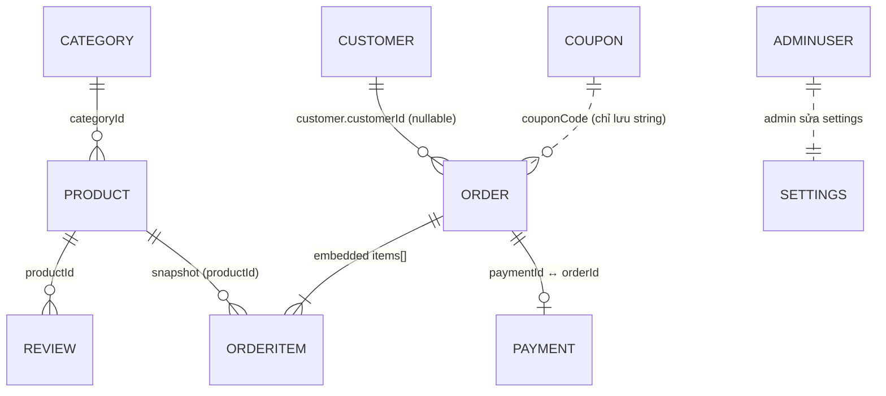
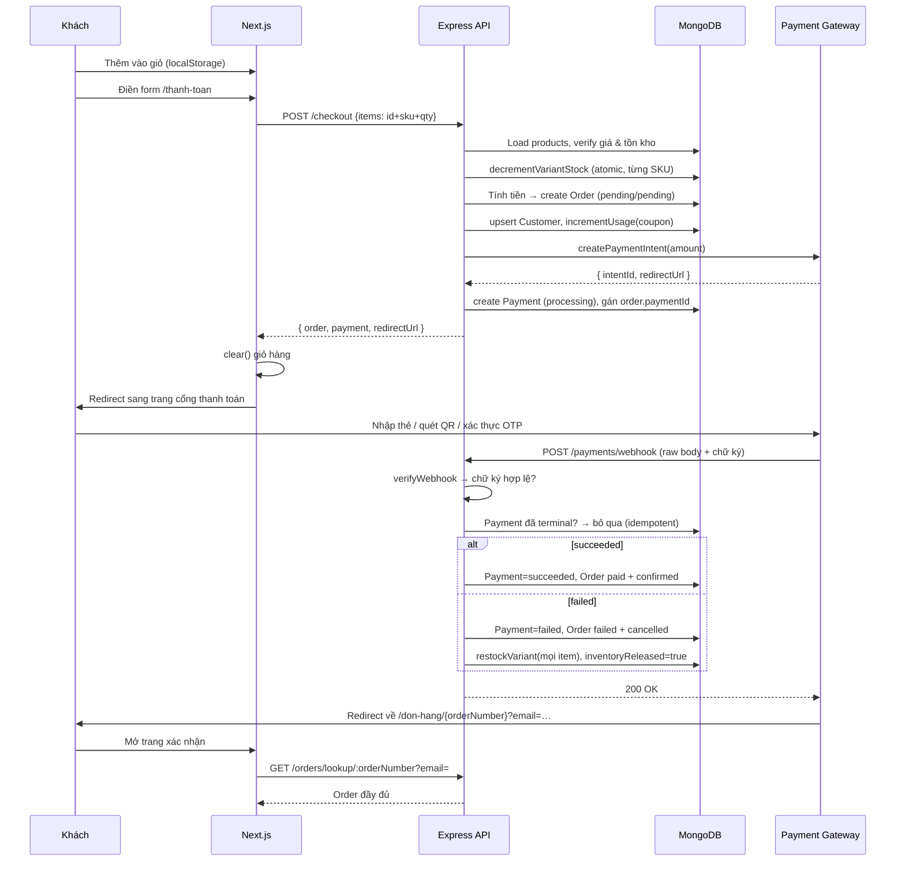
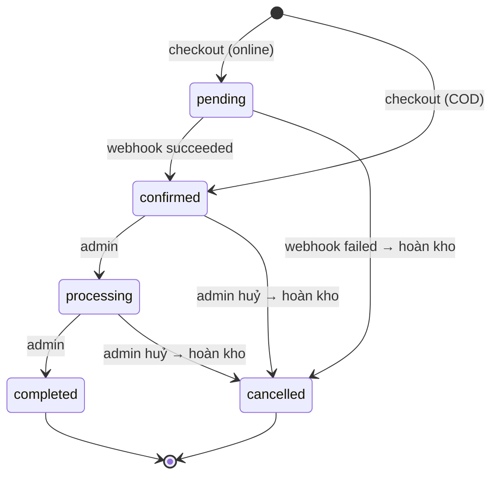

# LylaGlass — Tổng quan kỹ thuật toàn dự án

> Mục tiêu tài liệu: đọc xong hiểu được toàn bộ hệ thống như thể chính mình đã code từ đầu.
> Phạm vi: stack, kiến trúc, database, authentication, và **luồng đầy đủ** từ add-to-cart → checkout → thanh toán → webhook → đơn hàng → tồn kho → dòng tiền.
>
> Tài liệu liên quan: [REFERENCE_ANALYSIS.md](REFERENCE_ANALYSIS.md) (phân tích UI/UX của site tham chiếu — nguồn gốc của design tokens), [README.md](README.md) (hướng dẫn chạy).

---

## 1. Bức tranh tổng thể

LylaGlass là website thương mại điện tử bán ly thủy tinh, kiến trúc **decoupled**: một REST API độc lập và một Next.js app gọi API đó. Không dùng CMS/SaaS (Shopify chỉ là *tham chiếu thiết kế*, không phải nền tảng).

Ba đặc điểm định hình toàn bộ thiết kế:

1. **Guest-first** — khách không cần tài khoản để mua. Không có customer login. Chỉ **admin** mới có auth.
2. **Server-authoritative** — client gửi lên `productId + sku + quantity`; **giá, tồn kho, phí ship, giảm giá đều do backend tự tính lại**. Không bao giờ tin giá từ client.
3. **Provider-agnostic payment** — cổng thanh toán nằm sau interface `PaymentProvider`. Đổi Stripe → VNPay → MoMo chỉ cần thêm 1 class, không đụng vào Order system.

```
┌──────────────────────┐        HTTP/JSON         ┌──────────────────────┐
│  Next.js 16 (App     │ ───────────────────────► │  Express 4 + TS      │
│  Router) :3000       │ ◄─────────────────────── │  REST API :4000      │
│  - Storefront (SSR)  │                          │  Controller→Service  │
│  - Admin SPA (CSR)   │                          │  →Repository         │
└──────────────────────┘                          └──────────┬───────────┘
         │                                                    │ Mongoose
         │                                               ▼
         ▼                                         ┌──────────────────────┐
   Cloudinary CDN  ◄─── upload ảnh ────────────────│  MongoDB 7           │
                                                   └──────────────────────┘
                                                              ▲
                       ┌──────────────────────┐               │ webhook
                       │ Payment Gateway      │───────────────┘
                       │ (mock / Stripe / …)  │
                       └──────────────────────┘
```

---

## 2. Tech stack

### Backend — [backend/](backend/)

| Thành phần | Công nghệ | Ghi chú |
|---|---|---|
| Runtime / ngôn ngữ | Node.js + TypeScript 5.7 | `tsx watch` khi dev, `tsc` + `tsc-alias` khi build (alias `@/*` → `src/*`) |
| Web framework | Express 4.21 | |
| Database | MongoDB 7 + Mongoose 8 | Docker container `lylaglass-mongo` |
| Validation | Zod 3 | Schema đặt ở `validators/`, áp qua middleware `validate()` |
| Auth | `jsonwebtoken` + `bcryptjs` | JWT HS256, chỉ cho admin |
| Bảo mật | `helmet`, `cors`, `express-rate-limit` | Rate limit 300 req / 15 phút trên `/api` |
| Logging | `pino` + `pino-http` | `pino-pretty` khi dev |
| Upload ảnh | `multer` (memory) + Cloudinary SDK | Buffer → stream thẳng lên Cloudinary, không lưu đĩa |
| Sinh mã | `nanoid` | Order number + payment intent id |

### Frontend — [frontend/](frontend/)

| Thành phần | Công nghệ | Ghi chú |
|---|---|---|
| Framework | Next.js 16 (App Router) + React 19 | `next dev --webpack` (né lỗi Turbopack trên Windows) |
| Styling | Tailwind CSS v4 + shadcn/ui (`@base-ui/react`) | Design tokens trong [globals.css](frontend/src/app/globals.css) |
| Server state | TanStack Query v5 | Dùng ở phần client-side (admin, coupon, checkout mutation) |
| Client state | Zustand + `persist` | Giỏ hàng & admin session lưu localStorage |
| Form | react-hook-form + `@hookform/resolvers` + Zod | Cùng schema-style với backend |
| Toast | `sonner` | |
| Font | Playfair Display (heading) + Be Vietnam Pro (body) | `next/font/google`, có subset `vietnamese` |
| Icons | `lucide-react` | |

### Hạ tầng

- [docker-compose.yml](docker-compose.yml) — hiện chỉ chạy service `mongo:7` (volume `mongo-data`). Backend có [Dockerfile](backend/Dockerfile) riêng nhưng chưa được khai báo trong compose.
- Cấu hình qua biến môi trường, tập trung một chỗ tại [env.ts](backend/src/config/env.ts). Mẫu đầy đủ ở [backend/.env.example](backend/.env.example).

---

## 3. Kiến trúc backend: Controller → Service → Repository

Mỗi tầng có đúng một trách nhiệm, không nhảy cóc:

```
routes/          Khai báo URL + gắn middleware (validate, requireAdmin)
   ↓
middlewares/     validate (Zod) · requireAdmin (JWT) · upload (multer) · errorHandler
   ↓
controllers/     Bóc req → gọi service → sendSuccess/sendCreated. KHÔNG chứa logic.
   ↓
services/        Toàn bộ business logic: checkout, coupon, shipping, payment, order lifecycle.
   ↓
repositories/    Mọi truy vấn Mongoose. Tầng duy nhất được chạm vào Model.
   ↓
models/          Schema Mongoose + index + virtual.
```

Hai tầng ngang được dùng xuyên suốt:

- **`payments/`** — abstraction cổng thanh toán ([PaymentProvider.ts](backend/src/payments/PaymentProvider.ts)). Service chỉ nói chuyện với interface này.
- **`utils/`** — `ApiError` (lỗi có status code), `asyncHandler` (bắt lỗi async cho Express 4), `apiResponse` (chuẩn hoá response), `orderNumber` (sinh mã đơn).

### Vòng đời một request

1. `helmet` → `cors` (chỉ cho phép `CLIENT_ORIGIN`) → `compression` → `pino-http` → `rateLimit`.
2. **`/api/payments` được mount TRƯỚC `express.json()`** — xem [app.ts](backend/src/app.ts#L38). Đây là chi tiết quan trọng: webhook cần **raw body** (Buffer) để verify chữ ký của cổng thanh toán trên đúng byte gốc. Nếu JSON parse trước, chữ ký sẽ không khớp.
3. `express.json({ limit: "1mb" })` cho mọi route còn lại.
4. `/api/*` → [routes/index.ts](backend/src/routes/index.ts) → controller.
5. Lỗi rơi xuống [errorHandler](backend/src/middlewares/errorHandler.ts), map thành HTTP status:
   - `ZodError` → 400 kèm `details[{path, message}]`
   - `CastError` (ObjectId sai định dạng) → 400
   - Mongo duplicate key (`code 11000`) → 409
   - `ApiError` → status của chính nó
   - còn lại → 500 (kèm stack **chỉ khi không phải production**)

### Response contract (đồng nhất toàn API)

```jsonc
// thành công
{ "success": true, "data": <T>, "pagination"?: { page, limit, total, totalPages } }
// thất bại
{ "success": false, "error": { "message": "…", "details"?: [...] } }
```

Frontend bọc contract này trong [lib/api/client.ts](frontend/src/lib/api/client.ts) và ném `ApiClientError` (có `.status`, `.details`) nếu `success !== true`.

---

## 4. Database — 9 collections

Tất cả model dùng `{ timestamps: true }` (tự có `createdAt`/`updatedAt`).

### 4.1 Sơ đồ quan hệ



### 4.2 Chi tiết từng collection

**`Product`** — [Product.model.ts](backend/src/models/Product.model.ts)
Trung tâm của catalog. Điểm mấu chốt: **variants là subdocument array nhúng thẳng vào product**, không tách collection riêng.

```ts
{
  name, slug (unique, index), shortDescription, description,
  categoryId → Category, vendor,
  images: [{ url, alt, position }],
  variants: [{                 // bắt buộc ≥ 1 (validator)
    sku, name,                 // vd "Dung tích 300ml"
    attributes: Map<string,string>,
    price, compareAtPrice,
    inventoryQty,              // ← TỒN KHO NẰM Ở ĐÂY, theo từng SKU
    imageUrl, weight
  }],
  optionName,                  // nhãn của variant selector, vd "Dung tích"
  tags[], material, capacity, features[], careInstructions[],
  status: draft|active|archived,
  isFeatured, isBestseller, isNewArrival,
  ratingAverage, reviewCount,  // denormalize từ Review để khỏi aggregate mỗi lần render
  seoTitle, seoDescription
}
```
- Index: `{ name, shortDescription, tags }` **text index** (phục vụ search `$text`), và compound `{ categoryId, status, createdAt }`.
- Virtual (serialize kèm JSON): `minPrice`, `maxCompareAtPrice`, `totalInventory`.

**`Category`** — `name`, `slug` (unique), `description`, `image`, `sortOrder`, SEO fields, `isActive`. Seed tạo 3 danh mục: `gifting` (Quà Tặng), `seasonal` (Theo Mùa), `daily-moods` (Tâm Trạng Mỗi Ngày).

**`Order`** — [Order.model.ts](backend/src/models/Order.model.ts) — model quan trọng nhất.

```ts
{
  orderNumber,                  // unique, dạng LG20260817-K7M2XQ
  customer: { customerId?, name, email, phone },   // customerId nullable → guest
  shippingAddress, billingAddress,                 // embedded, VN-style: line1/ward/district/province
  items: [{                     // SNAPSHOT tại thời điểm mua
    productId, productName, slug, image,
    sku, variantName, variantAttributes,
    quantity, unitPrice, compareAtPrice, lineTotal
  }],
  subtotal, shippingFee, discountTotal, couponCode, total, currency: "VND",
  customerNote,
  paymentMethod: cod|card|bank_transfer|mock,
  paymentId → Payment,
  paymentStatus:  pending | paid | failed | refunded          (index)
  orderStatus:    pending | confirmed | processing | completed | cancelled  (index)
  shippingStatus: unfulfilled | processing | shipped | delivered | returned (index)
  shippingCarrier, trackingNumber,
  inventoryReleased: bool       // cờ chống hoàn kho 2 lần
}
```

> **Vì sao snapshot?** `items[]` copy tên/ảnh/giá tại thời điểm đặt. Sau này admin đổi giá hay xoá sản phẩm, đơn cũ vẫn nguyên vẹn. Đơn hàng **không bao giờ** join ngược lại Product để tính tiền.

> **Vì sao 3 status tách rời?** Tiền, quy trình xử lý, và vận chuyển là ba trục độc lập. Một đơn có thể `paymentStatus=paid` + `orderStatus=processing` + `shippingStatus=unfulfilled` cùng lúc — gộp thành một enum sẽ nổ tổ hợp.

**`Payment`** — [Payment.model.ts](backend/src/models/Payment.model.ts)

```ts
{
  orderId → Order (index),
  provider: mock|stripe,
  intentId (index),             // id bên phía cổng thanh toán
  idempotencyKey (unique),      // = `checkout_<orderId>` → 1 order chỉ tạo được 1 payment
  amount, currency,
  status: requires_action | processing | succeeded | failed | refunded (index),
  method, last4, failureReason,
  rawEvent: Mixed               // lưu nguyên payload webhook để đối soát/debug
}
```

**`Customer`** — được tạo **lazily** từ thông tin checkout, match theo `email` (unique). Không có password, không login. Chỉ để admin nhận diện khách quay lại: `ordersCount`, `totalSpent` được `$inc` mỗi lần đặt hàng.

**`Coupon`** — `code` (unique, uppercase), `type: percentage|fixed|free_shipping`, `value`, `minimumSubtotal`, `maxDiscountAmount`, `usageLimit`/`usageCount`, `startsAt`/`endsAt`, `isActive`.

**`Review`** — `productId`, `rating (1-5)`, `authorName`, `title`, `body`, `isVerifiedPurchase`, `isApproved` (mặc định `true` — tức auto-publish).

**`AdminUser`** — `name`, `email` (unique), `passwordHash` (bcrypt cost 10), `role: owner|staff`, `isActive`, `lastLoginAt`.

**`Settings`** — **singleton** (một document duy nhất, khoá bởi `key: "store"`). Chứa `freeShippingThreshold` (490.000đ), `flatShippingFee` (30.000đ), `storeName`, `supportEmail`, `supportPhone`. Repository dùng `findOneAndUpdate(..., { upsert: true })` nên luôn tồn tại kể cả DB trống.

---

## 5. Authentication & Authorization

### 5.1 Khách hàng: KHÔNG có auth

Đây là quyết định thiết kế, không phải thiếu sót. Guest checkout hoàn toàn:

- Giỏ hàng nằm ở **localStorage** (Zustand `persist`, key `lylaglass-cart`) — không có server-side cart, không session.
- Tra cứu đơn hàng dùng cặp **`orderNumber` + `email`** làm "mật khẩu yếu": [`getOrderForCustomer`](backend/src/services/order.service.ts) chỉ trả đơn khi email khớp (so sánh case-insensitive). Route: `GET /api/orders/lookup/:orderNumber?email=…`.
- Trang xác nhận đơn `/don-hang/[orderNumber]?email=…` gắn `robots: { index: false }` để không lọt vào search engine.

### 5.2 Admin: JWT Bearer

```
POST /api/admin/auth/login  { email, password }
   → bcrypt.compare(password, admin.passwordHash)
   → jwt.sign({ sub: adminId, role }, JWT_SECRET, { expiresIn: "7d" })
   → { token, admin: { id, name, email, role } }
```

Mọi route admin đi qua [`requireAdmin`](backend/src/middlewares/adminAuth.ts):
1. Đọc header `Authorization: Bearer <token>`.
2. `jwt.verify` với `JWT_SECRET`.
3. **Query lại DB** kiểm tra admin còn tồn tại và `isActive` — nên vô hiệu hoá tài khoản có hiệu lực ngay, không cần chờ token hết hạn.
4. Gắn `req.admin = { sub, role }`.

`requireRole("owner")` là lớp thứ hai, dùng cho các thao tác nhạy cảm: xoá category, sửa Settings.

**Phía frontend**: token lưu trong Zustand persist (`lylaglass-admin-auth` → localStorage). [`useAdminGuard`](frontend/src/hooks/use-admin-guard.ts) đợi hydrate xong rồi redirect về `/quan-tri/dang-nhap` nếu không có token. Vì token ở localStorage nên **toàn bộ admin panel là client-side render** — middleware/SSR không đọc được nó.

> **Đánh đổi đã biết**: localStorage dễ bị XSS hơn httpOnly cookie. Chấp nhận được cho admin panel nội bộ; nếu siết bảo mật thì chuyển sang httpOnly cookie + CSRF token.

---

## 6. API surface

Base: `http://localhost:4000/api` · 🔓 công khai · 🔐 cần admin JWT · 👑 cần role `owner`

| Method | Endpoint | | Mô tả |
|---|---|---|---|
| GET | `/categories` | 🔓 | Danh mục đang active |
| GET | `/categories/:idOrSlug` | 🔓 | Chi tiết danh mục |
| POST/PATCH/DELETE | `/categories…` | 🔐/👑 | CRUD (delete cần owner) |
| GET | `/products` | 🔓 | List + filter: `page,limit,category,q,sort,minPrice,maxPrice,tag,inStockOnly` |
| GET | `/products/:slug` | 🔓 | PDP — trả `{ product, related[4] }` |
| GET/POST | `/products/:productId/reviews` | 🔓 | Đọc & viết đánh giá |
| POST/PATCH/DELETE | `/products…` | 🔐 | CRUD sản phẩm |
| PATCH | `/products/:id/inventory` | 🔐 | Set `inventoryQty` cho 1 SKU |
| POST | `/products/upload-image` | 🔐 | multipart → Cloudinary |
| **POST** | **`/checkout`** | 🔓 | **Tạo đơn — trái tim hệ thống** |
| **POST** | **`/payments/webhook`** | 🔓* | **Cổng thanh toán callback** (*bảo vệ bằng chữ ký, không phải JWT) |
| GET | `/orders/lookup/:orderNumber?email=` | 🔓 | Tra cứu đơn |
| GET/PATCH/POST | `/orders/admin…` | 🔐 | List, chi tiết, đổi status, huỷ đơn |
| POST | `/coupons/validate` | 🔓 | Kiểm tra mã trước khi đặt |
| GET/POST/PATCH/DELETE | `/coupons/admin…` | 🔐 | CRUD mã giảm giá |
| GET | `/customers/admin/all`, `/customers/admin/:id` | 🔐 | Danh sách khách |
| GET | `/admin/dashboard` | 🔐 | Thống kê tổng hợp |
| GET | `/settings` | 🔓 | Ngưỡng freeship, phí ship, thông tin liên hệ |
| PATCH | `/settings` | 👑 | Sửa settings |
| GET | `/health` | 🔓 | Healthcheck (ngoài `/api`, không rate-limit) |

Sort options của `/products`: `featured | newest | price_asc | price_desc | name_asc | name_desc | bestselling`.

---

## 7. LUỒNG ĐẦY ĐỦ: Add to cart → Checkout → Thanh toán → Đơn hàng

### 7.1 Giai đoạn 1 — Add to cart (100% client-side)

Không có API call nào trong bước này.

1. Trang PDP `/san-pham/[slug]` là **Server Component**, fetch product từ API lúc render (bao gồm `variants[].inventoryQty`).
2. [`PurchasePanel`](frontend/src/components/product-detail/purchase-panel.tsx) là Client Component: chọn variant → `useCartStore.addItem()`.
3. Item lưu vào Zustand kèm **`maxQuantity = variant.inventoryQty`** (snapshot tồn kho lúc xem trang). Store tự clamp `quantity ≤ maxQuantity`.
4. `addItem` set `isDrawerOpen = true` → Cart Drawer tự trượt ra.
5. Zustand `persist` ghi xuống localStorage key `lylaglass-cart`.

> `maxQuantity` chỉ là **UX guard**, không phải cơ chế bảo vệ. Tồn kho thật được kiểm tra lại và khoá atomic ở bước checkout — client có sửa localStorage cũng vô ích.

### 7.2 Giai đoạn 2 — Checkout

Trang [/thanh-toan](frontend/src/app/(storefront)/thanh-toan/page.tsx) (Client Component):

- Form validate bằng react-hook-form + Zod: họ tên, email, SĐT, địa chỉ (line1/line2/ward/district/province), ghi chú, phương thức thanh toán (`cod` | `mock`).
- Áp mã giảm giá gọi trước `POST /coupons/validate` để **preview** số tiền giảm (không lưu gì cả).
- Submit → `POST /api/checkout` với payload **chỉ chứa `{ productId, sku, quantity }`** — không gửi giá.

Backend [`processCheckout`](backend/src/services/checkout.service.ts) chạy 5 bước:

```
① LOAD & VALIDATE
   Với mỗi item: load Product từ DB.
   - product tồn tại & status === "active"?  không → 400
   - variant có sku đó?                      không → 400
   - inventoryQty >= quantity?               không → 409 (kèm { sku, available })
   Dựng lineItems[] với giá LẤY TỪ DB (variant.price), tính lineTotal.

② RESERVE STOCK (atomic, tuần tự từng SKU)
   productRepository.decrementVariantStock():
     findOneAndUpdate(
       { _id, variants: { $elemMatch: { sku, inventoryQty: { $gte: quantity } } } },
       { $inc: { "variants.$[v].inventoryQty": -quantity } },
       { arrayFilters: [{ "v.sku": sku }] }
     )
   Filter + update là MỘT thao tác atomic ở tầng document của MongoDB
   → hai checkout đồng thời cùng SKU KHÔNG THỂ cùng thành công vượt quá tồn kho.
   Trả null = hết hàng → rollback toàn bộ SKU đã trừ trước đó (releaseReservedStock)
                       → ném 409 "vừa hết hàng, vui lòng thử lại".

③ TÍNH TIỀN (server-side, tuyệt đối)
   subtotal      = Σ lineTotal
   discountTotal = evaluateCoupon(code, subtotal)   // kiểm tra lại hạn, lượt, min subtotal
                   percentage → round(subtotal*value/100), cap bởi maxDiscountAmount
                   fixed      → min(value, subtotal)
                   free_shipping → discount = 0, freeShipping = true
   shippingFee   = freeShipping ? 0
                 : subtotal >= settings.freeShippingThreshold ? 0
                 : settings.flatShippingFee
   total         = max(subtotal - discountTotal + shippingFee, 0)

④ TẠO ĐƠN
   orderNumber = "LG" + YYYYMMDD + "-" + nanoid(6, bảng chữ không nhập nhằng: bỏ 0/O/1/I)
   orderStatus = isCod ? "confirmed" : "pending"      ← COD tin ngay, online phải chờ tiền
   paymentStatus = "pending"
   → customerRepository.upsertFromOrder()  // upsert Customer theo email, $inc ordersCount/totalSpent
   → couponRepository.incrementUsage()     // nếu có mã

⑤ RẼ NHÁNH THEO PHƯƠNG THỨC
   COD    → return { order, payment: null, redirectUrl: null }   ← KẾT THÚC, đơn đã sống
   ONLINE → provider.createPaymentIntent({ orderId, orderNumber, amount, currency, email })
          → tạo Payment { intentId, idempotencyKey: `checkout_<orderId>`, status: "processing" }
          → order.paymentId = payment._id
          → return { order, payment, redirectUrl }
```

Toàn bộ bước ③④⑤ nằm trong `try/catch`; bất kỳ lỗi nào sau khi đã trừ kho đều gọi `releaseReservedStock()` để hoàn kho.

Frontend nhận kết quả:
- `redirectUrl == null` (COD) → `clear()` giỏ → điều hướng `/don-hang/{orderNumber}?email=…`
- `redirectUrl != null` → `clear()` giỏ → điều hướng sang trang cổng thanh toán, kèm `&email=…`

### 7.3 Giai đoạn 3 — Thanh toán & Webhook

Ở môi trường dev, [`MockPaymentProvider`](backend/src/payments/MockPaymentProvider.ts) trả `redirectUrl = /thanh-toan/gia-lap?intent=…&order=…&amount=…` — một trang **giả lập cổng thanh toán bên ngoài**, có 2 nút "thành công" / "thất bại". Nút đó gọi thẳng `POST /api/payments/webhook` **đúng như cách một cổng thật sẽ callback**. Đây là điểm quan trọng: luồng dev và luồng production đi qua **cùng một code path** ở backend.

[`handlePaymentWebhook`](backend/src/services/payment.service.ts):

```
1. provider.verifyWebhook(rawBody, headers)
   → Mock: parse JSON, tin tưởng payload (chỉ dev)
   → Stripe (khi bật): stripe.webhooks.constructEvent(rawBody, sig, webhookSecret)
     ⇒ ĐÂY LÀ LÝ DO route này mount trước express.json()
   → chuẩn hoá thành VerifiedWebhookEvent { intentId, status, amount, currency, method, last4, … }

2. Tìm Payment theo intentId. Không thấy → 404 + log warn.

3. IDEMPOTENCY: nếu payment.status đã thuộc {succeeded, failed, refunded}
   → return { alreadyProcessed: true }, KHÔNG làm gì thêm.
   (Cổng thanh toán retry webhook là chuyện bình thường; không có bước này
    thì một webhook lặp có thể hoàn kho hai lần hoặc ghi đè trạng thái.)

4. Cập nhật Payment: status, method, last4, failureReason, rawEvent (lưu nguyên payload).

5. Đồng bộ Order theo kết quả:
   succeeded → paymentStatus = "paid"
               orderStatus: "pending" → "confirmed" (giữ nguyên nếu đã tiến xa hơn)
   failed    → paymentStatus = "failed", orderStatus = "cancelled"
               + HOÀN KHO toàn bộ items (restockVariant), set inventoryReleased = true
   refunded  → paymentStatus = "refunded"
```

### 7.4 Sequence diagram — luồng thanh toán online



### 7.5 "Đơn tự động được tạo như nào?"

Không có cron job hay background worker. Đơn được tạo **đồng bộ ngay trong request `POST /checkout`** — trước cả khi khách chạm vào cổng thanh toán. Lý do:

- Cần **giữ chỗ tồn kho** trước, nếu không khách trả tiền xong mới phát hiện hết hàng.
- Cần **`orderId`** để làm khoá liên kết với payment intent — webhook sau này chỉ có `intentId` để tra ngược về đơn.

Cái được "tự động" là **chuyển trạng thái đơn**, do webhook kích hoạt, chứ không phải việc tạo đơn.

Máy trạng thái đầy đủ:



`orderStatus=completed` **không thể** huỷ ([order.service.ts](backend/src/services/order.service.ts) chặn bằng 400).

### 7.6 "Tiền chuyển về ngân hàng như nào?"

Cần nói rõ ranh giới: **hệ thống này không bao giờ chạm vào tiền, và không bao giờ thấy số thẻ.** Backend chỉ ghi nhận *trạng thái* của một giao dịch mà cổng thanh toán thực hiện.

Ba đường tiền tương ứng ba `paymentMethod`:

**a) COD** — không có cổng thanh toán nào tham gia. Đơn vị vận chuyển thu tiền mặt khi giao, rồi đối soát và chuyển khoản (COD remittance) về tài khoản shop theo chu kỳ. Trong code, COD `return` sớm ở bước ⑤ và không tạo Payment document nào. Việc đánh dấu `paymentStatus=paid` cho đơn COD hiện **phải làm thủ công qua admin** — chưa có endpoint riêng cho việc này.

**b) Online (`card` / `mock`)** — dòng tiền thật đi hoàn toàn bên ngoài hệ thống:

```
Thẻ khách → Cổng thanh toán (Stripe/VNPay/MoMo) → Acquiring bank
   → Cổng giữ tiền, trừ phí (≈1.5–3.9%)
   → Payout theo chu kỳ (T+1 → T+7) về tài khoản ngân hàng của shop
```

Backend chỉ nhận **1 tín hiệu duy nhất**: webhook `succeeded`. Từ đó đánh dấu `paymentStatus=paid`. Số tiền thực tế về ngân hàng đến sau đó vài ngày và **không được model trong hệ thống này** — không có bảng `Payout`/`Settlement`, không có đối soát tự động. `Payment.rawEvent` lưu nguyên payload webhook chính là để phục vụ đối soát thủ công về sau.

**c) `bank_transfer`** — enum đã khai báo trong Order model nhưng **chưa có luồng xử lý**. Nếu triển khai, hướng đi tự nhiên là: hiển thị QR VietQR / số tài khoản → khách chuyển khoản → hoặc admin xác nhận thủ công, hoặc tích hợp webhook biến động số dư của ngân hàng (Casso/SePay) đẩy vào chính endpoint `/payments/webhook` với một provider class mới.

**Trạng thái hiện tại**: `PAYMENT_PROVIDER=mock`. [`StripePaymentProvider`](backend/src/payments/StripePaymentProvider.ts) là stub có TODO rõ ràng — ném lỗi nếu bị gọi. Để bật cổng thật: implement 2 method (`createPaymentIntent`, `verifyWebhook`), đặt `PAYMENT_PROVIDER=stripe` + 2 secret. **Không cần sửa một dòng nào trong Order/Checkout service** — đó chính là mục đích của abstraction.

### 7.7 Nhất quán tồn kho — tóm tắt

| Tình huống | Cơ chế |
|---|---|
| 2 khách mua SKU cuối cùng cùng lúc | `findOneAndUpdate` với điều kiện `inventoryQty >= quantity` trong filter — atomic ở tầng document, chỉ 1 người thắng |
| Cart có 3 item, item thứ 3 hết hàng | `releaseReservedStock()` hoàn lại 2 item đã trừ, ném 409 |
| Lỗi bất kỳ sau khi trừ kho | `catch` bao ngoài bước ③④⑤ → hoàn kho → ném lại lỗi |
| Thanh toán thất bại | Webhook `failed` → hoàn kho + `inventoryReleased = true` |
| Admin huỷ đơn | `cancelOrder()` → hoàn kho + `inventoryReleased = true` |
| Webhook gửi lặp / admin huỷ đơn đã huỷ | Cờ `inventoryReleased` + kiểm tra terminal status → không hoàn kho 2 lần |

> **Hạn chế đã biết**: MongoDB transaction (multi-document) **không** được dùng. Trừ kho tuần tự từng SKU + rollback thủ công là "compensating transaction" chứ không phải ACID thật. Nếu process crash đúng giữa vòng lặp reserve, một phần kho sẽ bị giữ vĩnh viễn. Muốn chặt chẽ hơn thì cần replica set + `session.withTransaction()`.

---

## 8. Frontend

### 8.1 Cấu trúc route

Toàn bộ URL đặt bằng **tiếng Việt không dấu**, có ý nghĩa SEO.

**Storefront** — [src/app/(storefront)/](frontend/src/app/(storefront)/), dùng route group `(storefront)` nên `(storefront)` không xuất hiện trong URL. Layout dùng chung: AnnouncementBar → Header → `{children}` → Footer → CartDrawer.

| Route | Render | Mô tả |
|---|---|---|
| `/` | Server | Homepage: hero, marquee, category grid, product sections, about, FAQ, contact, newsletter |
| `/san-pham` | Server | Tất cả sản phẩm + filter/sort/pagination |
| `/san-pham/[slug]` | Server | PDP + JSON-LD `Product` schema + `generateMetadata` động |
| `/danh-muc/[slug]` | Server | PLP theo danh mục |
| `/tim-kiem` | Server | Kết quả tìm kiếm (`$text` search) |
| `/gio-hang` | Client | Trang giỏ hàng đầy đủ |
| `/thanh-toan` | Client | Form checkout |
| `/thanh-toan/gia-lap` | Client | Cổng thanh toán giả lập (dev) |
| `/don-hang/[orderNumber]` | Server | Xác nhận đơn (`noindex`) |
| `/tra-cuu-don-hang` | Client | Tra cứu bằng mã đơn + email |
| `/gioi-thieu`, `/lien-he`, `/cau-hoi-thuong-gap` | Server | Trang tĩnh |

**Admin** — [src/app/quan-tri/](frontend/src/app/quan-tri/), toàn bộ **client-side** (vì token ở localStorage), layout Sidebar + Topbar, bọc bởi `useAdminGuard`.

`/quan-tri` (dashboard) · `/dang-nhap` · `/san-pham` + `/moi` + `/[id]` · `/danh-muc` · `/don-hang` + `/[id]` · `/khach-hang` · `/ma-giam-gia` · `/ton-kho` · `/van-chuyen` · `/thanh-toan`

### 8.2 Chiến lược render & data fetching

- **Storefront = Server Components**: gọi `apiClient` trực tiếp từ server, HTML đến browser đã có nội dung → tốt cho SEO. Chỉ những gì cần tương tác (`PurchasePanel`, `CartDrawer`, form) mới là Client Component.
- **Admin = Client Components + TanStack Query**: cần token trong localStorage.
- **Fail-soft**: storefront layout bọc `getLayoutData()` trong `try/catch` với `FALLBACK_SETTINGS` — API chết thì trang vẫn render được khung.
- SEO: `sitemap.ts` + `robots.ts` sinh động, `generateMetadata` per-page, JSON-LD trên PDP.

### 8.3 State

| State | Nơi lưu | Key |
|---|---|---|
| Giỏ hàng | Zustand + persist | `lylaglass-cart` (localStorage) |
| Admin session | Zustand + persist | `lylaglass-admin-auth` (localStorage) |
| Server data (admin) | TanStack Query cache | in-memory |
| Server data (storefront) | fetch trong Server Component | Next.js cache |

### 8.4 Design system

Tokens trong [globals.css](frontend/src/app/globals.css) dùng **oklch**, kế thừa từ phân tích site tham chiếu (REFERENCE_ANALYSIS §7):

- Nền kem ấm · primary **dusty rose** · secondary **mint** · **coral** cho badge sale · chữ nâu-xám.
- **Button `radius: 40px` (pill) nhưng input `radius: 6px`** — đây là chủ ý, hai token tách biệt, không dùng chung.
- Product card `radius: 1rem`, media `radius: 8px`.
- Font: Playfair Display (heading, serif) + Be Vietnam Pro (body, có dấu tiếng Việt).

---

## 9. Vận hành & cấu hình

### Biến môi trường backend

```bash
NODE_ENV, PORT=4000, API_BASE_URL, CLIENT_ORIGIN=http://localhost:3000
MONGODB_URI=mongodb://localhost:27017/lylaglass
JWT_SECRET, JWT_EXPIRES_IN=7d, ADMIN_SEED_EMAIL, ADMIN_SEED_PASSWORD
CLOUDINARY_CLOUD_NAME / API_KEY / API_SECRET
PAYMENT_PROVIDER=mock|stripe, STRIPE_SECRET_KEY, STRIPE_WEBHOOK_SECRET
RATE_LIMIT_WINDOW_MS=900000, RATE_LIMIT_MAX=300
```

Frontend: `NEXT_PUBLIC_API_URL` (mặc định `http://localhost:4000/api`), `NEXT_PUBLIC_SITE_URL`.

### Khởi động

```bash
docker compose up -d mongo
cd backend  && cp .env.example .env && npm i && npm run seed && npm run dev   # :4000
cd frontend && cp .env.example .env.local && npm i && npm run dev             # :3000
```

`npm run seed` xoá sạch Categories/Products/Coupons/Reviews rồi tạo lại; Settings & AdminUser dùng upsert nên **không mất tài khoản admin** khi seed lại.

### Thứ tự khởi động quan trọng

Storefront layout fetch categories + settings ngay lúc SSR → chạy frontend trước khi backend sẵn sàng thì trang render bằng fallback (menu rỗng). Refresh sau khi backend lên là xong.

---

## 10. Bản đồ "muốn sửa X thì vào đâu"

| Việc cần làm | File |
|---|---|
| Đổi logic tính phí ship | [shipping.service.ts](backend/src/services/shipping.service.ts) |
| Thêm loại mã giảm giá mới | [coupon.service.ts](backend/src/services/coupon.service.ts) + enum trong [Coupon.model.ts](backend/src/models/Coupon.model.ts) |
| Tích hợp cổng thanh toán thật | Implement [StripePaymentProvider.ts](backend/src/payments/StripePaymentProvider.ts) (hoặc class mới) + đăng ký ở [payments/index.ts](backend/src/payments/index.ts) |
| Đổi quy tắc trạng thái đơn | [payment.service.ts](backend/src/services/payment.service.ts) (tự động) + [order.service.ts](backend/src/services/order.service.ts) (thủ công) |
| Thêm trường vào sản phẩm | [Product.model.ts](backend/src/models/Product.model.ts) + [product.validators.ts](backend/src/validators/product.validators.ts) + [product-form.tsx](frontend/src/components/admin/product-form.tsx) |
| Đổi màu / typography | [globals.css](frontend/src/app/globals.css) |
| Thêm route API | `routes/` → `controllers/` → `services/` → `repositories/` (đúng thứ tự tầng) |
| Sửa logic giỏ hàng client | [cart-store.ts](frontend/src/store/cart-store.ts) |

---

## 11. Giới hạn đã biết

1. **Không có test tự động** — không unit, không integration, không e2e.
2. **Không dùng MongoDB transaction** — xem §7.7.
3. **Cổng thanh toán thật chưa tích hợp** — chỉ có mock provider.
4. **Không có email transactional** — khách không nhận mail xác nhận đơn.
5. **Không đối soát dòng tiền** — không có model Payout/Settlement.
6. **Đơn COD không có endpoint đánh dấu "đã thu tiền"** — phải sửa qua admin.
7. **Review auto-publish** (`isApproved` mặc định `true`) và **không kiểm chứng đã mua hàng** — dễ bị spam.
8. **Ảnh sản phẩm dùng Unsplash placeholder** — cần thay ảnh thật trước production.
9. **Form Liên hệ & Newsletter chỉ hiện toast**, không lưu backend.
10. **Backend chưa có trong docker-compose** — Dockerfile có sẵn nhưng compose mới chỉ chạy Mongo.
11. **`/payments/webhook` không rate-limit** (mount trước middleware limiter) — với provider thật thì chữ ký là lớp bảo vệ duy nhất.
